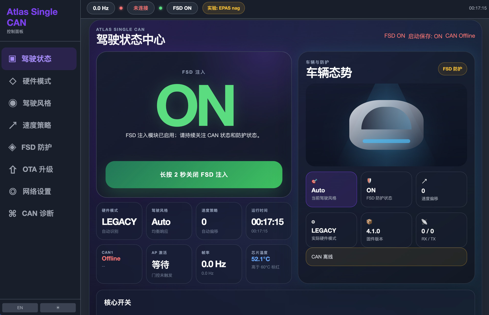
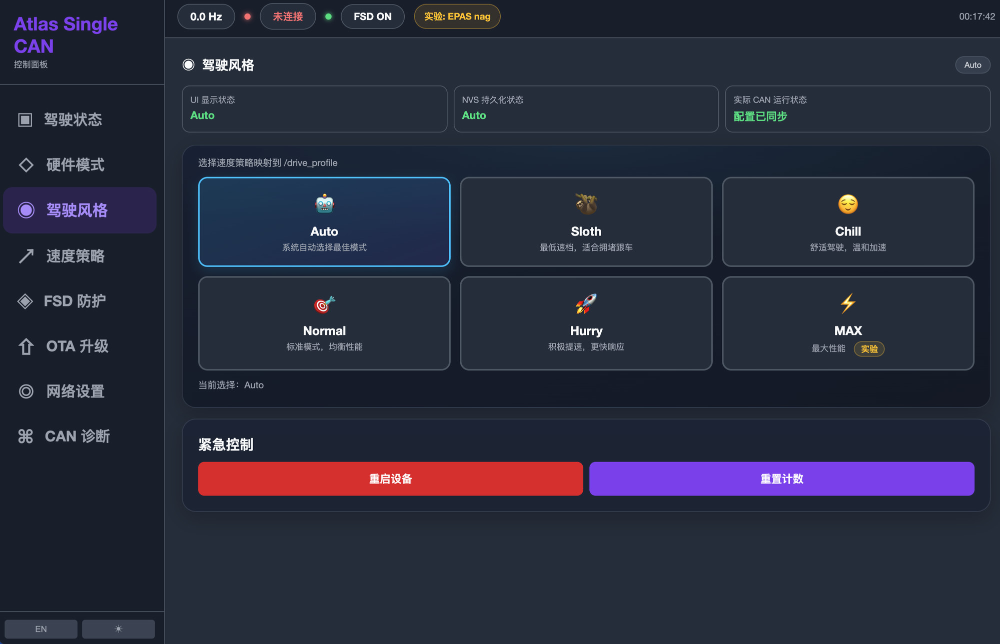
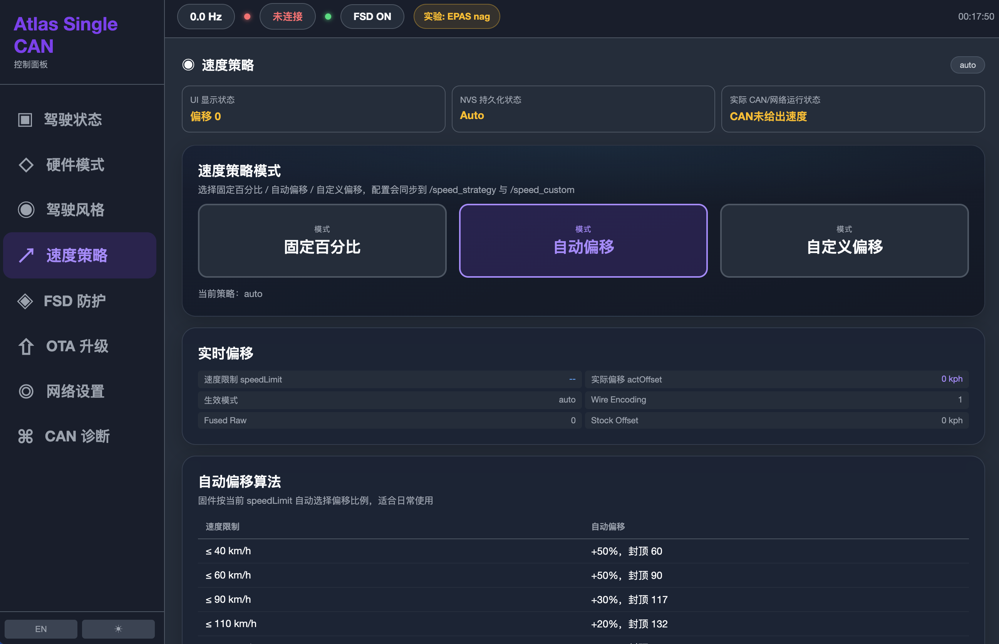
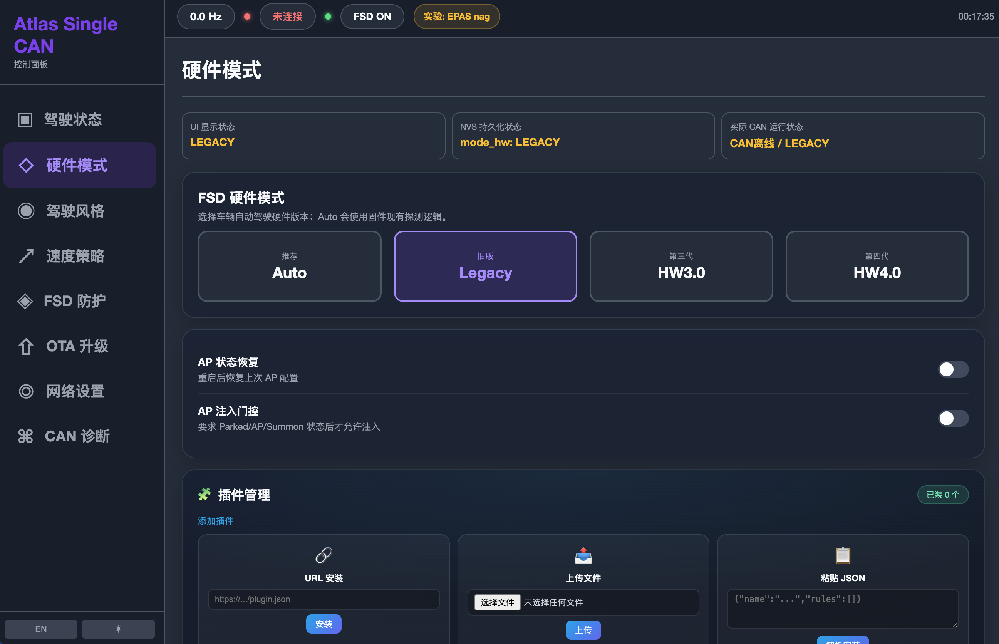
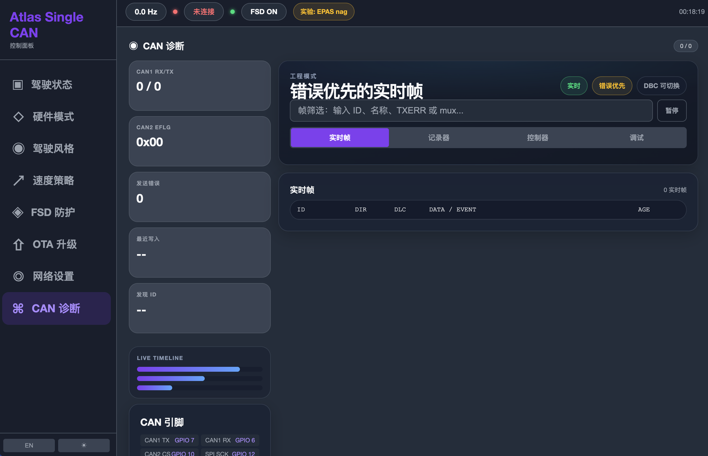
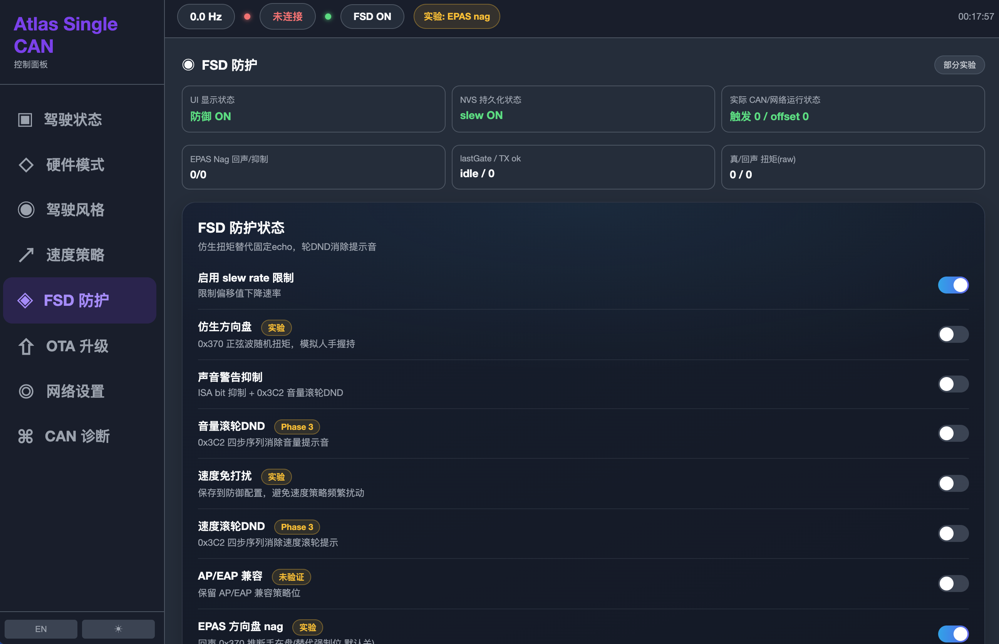
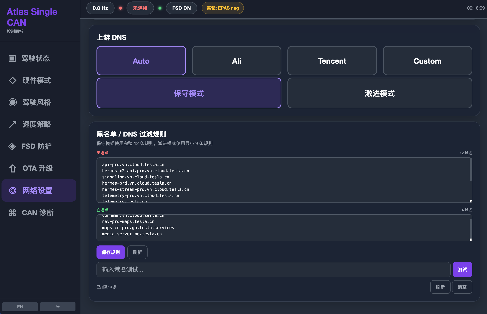
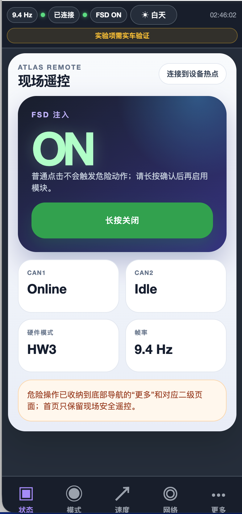

# 📗 Atlas-FSD 操作手册

> [!info] 文档信息
> **版本**：v1.0.9-atlas-single-can ｜ **适用固件**：Waveshare 单 CAN standalone
> **仓库**：<https://github.com/JordanzhaoD/waveshare-single-can-firmware>
> **验证状态**：发布候选已完成本地自动化、16MB clean build 与资产校验；尚未公开发布、烧录、OTA 或实车验证
> **协议**：GPL-3.0 ｜ **最新版**：见仓库

> [!danger] 免责声明
> 本项目仅供**研究、教育与工程学习**目的，**严禁在公共道路使用**。可能违反当地交通法规与车辆制造商服务条款。使用本固件的一切法律与安全风险由使用者自行承担，作者不承担任何责任。

## 📑 目录

1. [项目简介](#1-项目简介)
2. [硬件准备](#2-硬件准备)
3. [接线](#3-接线)
4. [固件烧录](#4-固件烧录)
5. [首次连接](#5-首次连接)
6. [Dashboard 功能详解](#6-dashboard-功能详解)
7. [系统配置](#7-系统配置)
8. [OTA 固件升级](#8-ota-固件升级)
9. [插件管理](#9-插件管理)
10. [CAN 诊断](#10-can-诊断)
11. [故障排查](#11-故障排查)
12. [安全与合规](#12-安全与合规)
13. [FAQ](#13-faq)

---

## 1 项目简介

**Atlas-FSD** 是一款开源的 Tesla FSD CAN 总线研究仪表盘。一块百元级的 ESP32-S3 开发板，接入车辆 party CAN 总线，通过板载 WiFi 热点提供驾驶舱风格的 Web 控制面板——手机/电脑/车机浏览器直接访问，无需 App。

> [!tip] 核心价值
> - 🔬 **研究可视化**：FSD 注入状态、车辆态势、CAN 帧实时可见
> - 💰 **低成本**：一块 ESP32-S3 板（约 ¥100）
> - 🌐 **零 App**：浏览器直连 `http://100.100.1.1/`
> - 🔓 **开源**：GPL-3.0，可审计可改造
> - 🛡 **安全门控**：AP Injection Gate fail-closed 设计

---

## 2 硬件准备

> [!check] 硬件清单
> | 组件 | 规格 | 备注 |
> |------|------|------|
> | 开发板 | Waveshare ESP32-S3-RS485-CAN | 或兼容 ESP32-S3 单 CAN 板 |
> | 主控 | ESP32-S3 | — |
> | Flash | 16 MB | OTA + SPIFFS 分区 |
> | CAN | TWAI 单路 | GPIO15 TX / GPIO16 RX |
> | 状态 LED | GPIO14 | 板载或外接 |
> | USB-C 数据线 | — | 烧录用（注意是数据线，非纯充电线）|

> [!warning] 硬件确认
> 烧录前确认开发板型号正确（ESP32-**S3**，非 ESP32），Flash **16MB**。型号或 Flash 大小不对会导致烧录失败或 bootloop。

---

## 3 接线

将开发板 TWAI 接入车辆 **party CAN 总线**（通常经维修连接器或 OBD-X197 接口的 party bus 引脚）：

| 开发板 | 连接车辆 |
|--------|---------|
| CAN High（TWAI TX 侧） | party CAN High |
| CAN Low（TWAI RX 侧） | party CAN Low |
| GND | 车身地（共地）|

> [!danger] 接线安全
> - **断电操作**：接线前关闭车辆，避免短路损坏开发板或车辆电路
> - **极性正确**：CAN High / CAN Low 不可接反，接反可能损坏开发板
> - **公共地**：开发板 GND 必须与车辆地共地，否则通信不稳定
> - **初次台架**：首次测试建议在台架/静态进行，确认接线无误

---

## 4 固件烧录

### 4.1 准备工具

> [!info] 依赖
> ```bash
> pip install esptool
> ```

从 [Release 页面](https://github.com/JordanzhaoD/waveshare-single-can-firmware/releases/latest)下载资产包（含 `merged-flash.bin`、分区 bin、`flash.sh`、`SHA256SUMS`），解压后进入目录。

### 4.2 方式一：逐分区升级（推荐）

> [!tip] 保留 NVS / SPIFFS 的常规升级
> ```bash
> ./flash.sh --split /dev/cu.usbserial-XXXX
> ```

`--split` 分别更新 bootloader、partition table、OTA data 与 app0；在分区布局不变时保留 NVS 和 SPIFFS，适合已有 WiFi、CAN 与运行时配置的设备。脚本会先自动校验 `SHA256SUMS`，校验失败时拒绝写入。

> [!example] 串口名（按系统替换）
> | 系统 | 串口示例 |
> |------|---------|
> | macOS | `/dev/cu.usbserial-XXXX` 或 `/dev/cu.usbmodemXXXX` |
> | Linux | `/dev/ttyUSB0` |
> | Windows | `COM3` |

### 4.3 方式二：工厂式合并烧录

> [!danger] merged-flash.bin 会覆盖 NVS
> ```bash
> ./flash.sh /dev/cu.usbserial-XXXX
> ```
>
> `merged-flash.bin` 从 `0x0` 连续写入，会覆盖并清空 NVS 配置。仅在需要验证全新默认值、恢复完整固件布局或明确接受配置丢失时使用；烧录前先导出设置备份。SPIFFS 位于更高地址，当前 merged image 通常不会覆盖它。

分区布局（**地址必须准确**）：

| 分区 | 偏移 | 文件 |
|------|------|------|
| bootloader | `0x0` | bootloader.bin |
| partitions | `0x8000` | partitions.bin |
| ota_data_initial | `0x19000` | ota_data_initial.bin |
| firmware (app0) | `0x20000` | firmware.bin |

> [!danger] 地址易错点
> - `firmware` 必须烧到 **`0x20000`**（**不是** `0x10000`，否则 bootloop）
> - `ota_data_initial` 必须烧 **`0x19000`**（缺失会导致 OTA slot 不可启动）
> - 顺序：先 bootloader → partitions → ota_data → firmware

### 4.4 方式三：源码自行编译

> [!info] 源码编译烧录
> ```bash
> git clone https://github.com/JordanzhaoD/waveshare-single-can-firmware
> cd waveshare-single-can-firmware
> pip install platformio
> cp platformio_profile.example.h platformio_profile.h
> # 编辑 platformio_profile.h 自定义凭据（见 §7）
> pio run -e waveshare_single_can_standalone
> pio run -e waveshare_single_can_standalone -t upload --upload-port /dev/cu.usbserial-XXXX
> ```

---

## 5 首次连接

> [!check] 首次连接 3 步
> 1. 烧录完成，开发板自动重启
> 2. 手机/电脑连接 WiFi 热点：**SSID `Atlas-FSD`** / 密码 **`12345678`**
> 3. 浏览器打开 <http://100.100.1.1/>，进入 Dashboard 驾驶舱界面

> [!tip] 出厂默认凭据（强烈建议修改，见 §7.1）
> | 项 | 默认值 |
> |----|--------|
> | WiFi SSID | `Atlas-FSD` |
> | WiFi 密码 | `12345678` |
> | OTA 用户名 | `admin` |
> | OTA 密码 | `12345678` |

> [!warning] 连不上热点？
> 若看不到 `Atlas-FSD` 热点：① 确认烧录成功（串口有启动日志）；② 默认凭据可能被自定义版本覆盖，用自定义 SSID；③ 按住 BOOT 键复位重新烧录。

---

## 6 Dashboard 功能详解

> [!info] 访问方式
> 桌面/车机/手机任意浏览器打开 <http://100.100.1.1/>，UI 自适应（桌面横屏 / 手机竖屏）。

### 6.1 驾驶状态中心

主界面，实时聚合显示：FSD 注入状态、车辆态势、硬件模式、驾驶风格、速度策略、CAN 总线状态。所有关键信息一屏掌握。



### 6.2 驾驶风格

切换驾驶模式：

| 模式 | 说明 |
|------|------|
| **Auto** | 自动（默认） |
| **Sloth** | 舒缓（延迟响应） |
| **MAX** | 激进（提前响应） |

同时显示 UI 状态、NVS 持久化状态、实际 CAN 运行状态。



### 6.3 速度策略

速度偏移控制：

- **固定百分比**：按百分比偏移车速报文
- **自动偏移**：自动算法调节
- **自定义偏移**：手动设定具体值

实时偏移参数可视化，便于研究车辆速度响应。



### 6.4 硬件模式

FSD 协议模式切换（运行时）：

| 模式 | 适用 |
|------|------|
| **Auto** | 自动识别（推荐，不确定时用） |
| **Legacy** | AP1/AP2 早期车型 |
| **HW3.0** | FSD 计算机 3.0 |
| **HW4.0** | FSD 计算机 4.0 |



> [!warning] 硬件模式选错
> 模式与车辆硬件不匹配会导致 FSD 功能异常或无响应。不确定时用 **Auto**，或根据车辆实际硬件选。

### 6.5 CAN 诊断

实时 CAN 总线诊断面板：

- **单路 TWAI CAN**：RX/TX 计数、控制器状态与错误标志（本产品不提供 CAN2）
- **错误优先实时帧**：异常帧优先显示
- **LIVE TIMELINE**：总线事件时间线
- **CAN 引脚信息**：引脚状态



> [!tip] 诊断价值
> CAN 诊断用于验证接线、排查通信问题。若 **RX=0**，检查接线 / 波特率 / 极性 / 共地。

### 6.6 FSD 防护与四模式 NAG

FSD 防护总开关是 NAG 算法的父 enable。历史字段 `bionicSteering` 继续用于兼容旧配置，但它**不是第五种算法**；实际算法由以下四模式选择器决定：

| 编号 | Dashboard 名称 | 运行语义 |
|------|----------------|----------|
| `0` | **Off** | 不运行 Legacy NAG 算法 |
| `1` | **Human Replay TSL6P** | 使用既有 TSL6P burst/replay 行为 |
| `2` | **EPAS Late Echo** | 使用 cadence-aware 延迟 echo |
| `3` | **Reactive Sustained Hold** | 包含 proactive 与 reactive 两个阶段的持续 hold |

父开关关闭时，运行时按 Off 处理，但已保存的模式选择不会被擦除；重新开启父开关后恢复所选模式。所有模式仍受 CAN/FSD 总开关、AP/checkAD、Abort Guard 与各自 feature gate 约束。

其它防护项包括：

- **slew rate 限制**：扭矩变化率限制（防止突变）
- **bit-19 baseline**：方向盘检测屏蔽的安全路径
- **Soft Engage**：Legacy `0x3EE mux0` 最终发送前的方向盘近居中/超时门控



> [!danger] NAG 与防护模式谨慎
> 四种 NAG 模式均为 opt-in 研究功能。历史事故记录和旧策略文档继续保留作为背景，但不再代表对当前 `0x370` 模式的 blanket ban。请以当前模式选择、父开关、运行诊断和既有安全门控为准。

### 6.7 AP Injection Gate 与 Instant Engage

Legacy AP-First gate 使用 primary AP status frame 判断状态：state `2` 不算 engaged，只有 state `3..6` 算 engaged；state `8/9`、disengage 或 runtime reset 会清除 transient timing。

- **AP 延迟**：可配置 `0–3000ms`，默认 `2000ms`。
- **Instant Engage (experimental)**：默认关闭。开启后，真实的 non-engaged → engaged 边沿可以**一次性**绕过尚未满足的 AP 延迟；持续 state `3..6` 不会重复 bypass。
- **父 gate 关闭**：Instant Engage 控件显示 inactive/disabled，但保存值保持不变。
- **不能绕过的门控**：CAN/FSD enablement、OTA blocking、父 AP gate、`checkAD`、gear logic、Abort Guard、Soft Engage、插件与功能 enablement。

`/status.fsdDiag.gate` 和串口 `system_status` 会报告 `instantEngageEnabled`、`apEngaged`、`apEdgeCount`、`lastApEdgeAgeMs`、`apDebounceBypassCount`、`edgePending`、`debounceSatisfied` 与 `instantBypassLast`，用于区分“检测到边沿”“实际消费 bypass”以及“被其它最终门控阻断”。

### 6.8 DNS / 过滤

上游 DNS 设置与黑/白名单域名过滤规则管理（DNS 过滤功能）。



### 6.9 手机端（现场遥控）

手机浏览器自动切换竖屏布局，提供现场遥控视图：FSD 注入状态、CAN 总线状态、硬件模式、实时帧率，便于车旁操作。



---

## 7 系统配置

### 7.1 修改 WiFi / OTA 凭据

> [!info] 需重新编译（凭据在编译期固化）
> 编辑 `platformio_profile.h`：
> ```cpp
> #define DASH_SSID      "你的热点名"
> #define DASH_PASS      "你的密码"
> #define DASH_OTA_USER  "admin"
> #define DASH_OTA_PASS  "你的OTA密码"
> ```
> 重新编译烧录（见 §4.4）。`platformio_profile.h` 已加入 `.gitignore`，不会提交，请妥善保管。

### 7.2 FSD 运行时配置

通过 Dashboard 设置页或 HTTP API 配置（无需重新编译）：

- Legacy 速度偏移
- 重写限速（Legacy / HW4）
- 视觉限速识别开关
- 四模式 Legacy NAG 与父防护开关
- AP Injection Gate、`0–3000ms` 延迟与 Instant Engage

> [!tip] 配置持久化
> 运行时配置持久化到 NVS，重启保留。Dashboard 通过 `GET /config` 回填显示，`POST /config` 保存。Instant Engage 使用 API 字段 `ap_first_edge`、NVS key `apfe`，默认 `false`；设置备份/恢复字段为 `device.apFirstEdge`。

### 7.3 OTA 更新仓库

固件 OTA 检查更新地址：`JordanzhaoD/waveshare-single-can-firmware`（GitHub Release）。如需指向自己的 fork，修改源码 `DASH_GITHUB_REPO` 后重新编译。

---

## 8 OTA 固件升级

> [!tip] OTA 一键升级
> Dashboard → 系统设置 → **检查更新** → 下载安装 → 自动重启

OTA 流程：

1. 设备请求 `api.github.com/repos/JordanzhaoD/waveshare-single-can-firmware/releases/latest`
2. 在资产列表查找 `firmware-waveshare-single-can.bin`
3. 下载 → 校验 → 写入备用 OTA 分区
4. 切换启动分区 → 重启到新固件

> [!warning] OTA 前置条件
> - 设备所在网络能访问 `github.com`
> - OTA 凭据正确（默认 `admin` / `12345678`）
> - 双 OTA 分区正常（`ota_data_initial` 已初始化）
> - 电量/供电稳定（升级中断需重新烧录）

---

## 9 插件管理

JSON 插件引擎支持三种安装方式：

| 方式 | 说明 |
|------|------|
| **URL 安装** | 输入插件 JSON 的 URL |
| **文件上传** | 上传 `.json` 插件文件 |
| **离线粘贴** | 直接粘贴 JSON 文本 |

插件特性：

- 🔒 **默认关闭**：新插件需手动启用
- 🎚 **优先级管理**：多插件按优先级执行
- 💾 **持久化**：状态存 SPIFFS `/plugins_state.json`，重启恢复
- 🔧 **管理 API**：启用/禁用/删除/详情

> [!info] 插件 API
> 通过 Dashboard 插件页或 `/plugins_*` 系列端点管理。

---

## 10 CAN 诊断

Dashboard 的 CAN 诊断页用于总线健康监测与调试：

| 指标 | 含义 | 健康判断 |
|------|------|---------|
| RX 计数 | 接收帧数 | 持续增长 = 接线正常 |
| TX 计数 | 发送帧数 | 反映注入活动 |
| EFLG | 错误标志 | 应为 0，非 0 表示总线错误 |
| 错误帧 | 异常帧 | 应为空，有则排查接线/波特率 |
| LIVE TIMELINE | 事件时间线 | 直观查看总线活动 |

> [!tip] 诊断排查
> 若 RX 长时间为 0：① 检查 CAN H/L 接线与极性；② 确认共地；③ 确认接入的是 party CAN（非其他总线）；④ 检查开发板 CAN 收发器。

---

## 11 故障排查

> [!bug] 常见问题速查
> | 症状 | 可能原因 | 解决方案 |
> |------|---------|---------|
> | 烧录失败 / 找不到串口 | USB 驱动 / 纯充电线 | 装 CP210x/CH340 驱动；换数据线；按住 BOOT 进下载模式 |
> | 启动 bootloop | firmware 地址错 | 烧 `0x20000` + `ota_data` `0x19000` |
> | 看不到 Atlas-FSD 热点 | 凭据未生效 / 启动失败 | 重新编译 profile.h；查串口启动日志 |
> | 打不开 100.100.1.1 | 未连热点 / 浏览器拦截 | 确认连了 Atlas-FSD 热点；关闭浏览器 HTTPS 强制 |
> | CAN 无数据（RX=0） | 接线 / 极性 / 共地 | 见 §10 诊断排查 |
> | OTA 失败 | 网络 / 凭据 / 仓库 | 确认能访问 github.com；核对 OTA 密码 |
> | 版本号显示旧 | 构建缓存 | 清 `.pio/build` 重新编译 |

> [!info] 串口日志
> ```bash
> pio device monitor              # PlatformIO
> # 或
> esptool.py --port /dev/cu.usbserial-XXXX run   # 复位 + 看
> ```
> 启动日志含 `build_id`（版本）、`canActive` 等关键状态；`system_status` 还会输出 Instant Engage/AP edge/bypass 证据，NAG 诊断会输出 `selectedMode`、`selectedModeName` 与 `runtimePhase`。

---

## 12 安全与合规

> [!danger] 必读——法律与安全
> - **仅供研究 / 教育 / 工程学习**：不得在公共道路使用
> - **法律风险**：可能违反当地交通法规、车辆保修条款、制造商服务条款
> - **安全风险**：不当配置可能影响车辆安全系统（转向、制动、辅助驾驶）
> - **责任归属**：使用者自行承担一切法律与安全后果，作者不承担任何责任

> [!tip] 安全实践建议
> - ✅ 台架 / 静态测试优先，确认无误再考虑实车
> - ✅ 修改配置前备份原值
> - ✅ 不绕过车辆原生安全机制
> - ✅ 遵守当地法律法规
> - ✅ 保持固件与上游同步（安全更新）

---

## 13 FAQ

> [!question] 支持哪些车型？
> Tesla 配 party CAN 总线的车型（Legacy / HW3 / HW4）。通过 Dashboard 硬件模式切换匹配。

> [!question] 需要联网吗？
> 基本功能离线可用。仅 OTA 检查更新需访问 `github.com`。

> [!question] 会不会和原车功能冲突？
> 本工具是 CAN 总线研究工具。不当配置可能影响车辆功能，务必谨慎，建议台架验证。

> [!question] 如何修改默认热点名和密码？
> 编辑 `platformio_profile.h` 的 `DASH_SSID` / `DASH_PASS` / `DASH_OTA_PASS`，重新编译烧录（见 §7.1）。

> [!question] OTA 更新到哪里找固件？
> GitHub Release 的 `firmware-waveshare-single-can.bin` 资产（见 §8）。

> [!question] 如何贡献代码 / 反馈问题？
> GitHub 提 issue 或 PR，项目 GPL-3.0 开源，欢迎社区贡献。

---

## 📚 附录

| 资源 | 链接 |
|------|------|
| 仓库主页 | <https://github.com/JordanzhaoD/waveshare-single-can-firmware> |
| Release 下载 | <https://github.com/JordanzhaoD/waveshare-single-can-firmware/releases> |
| 免责声明 | [DISCLAIMER.md](https://github.com/JordanzhaoD/waveshare-single-can-firmware/blob/main/DISCLAIMER.md) |
| 变更日志 | [CHANGELOG.md](https://github.com/JordanzhaoD/waveshare-single-can-firmware/blob/main/CHANGELOG.md) |
| 推广文案 | [PROMOTION.md](https://github.com/JordanzhaoD/waveshare-single-can-firmware/blob/main/docs/PROMOTION.md) |

---

> [!info] 文档版本
> 本手册对应 **v1.0.9-atlas-single-can** 发布候选。受保护的历史 PDF 本轮未重新生成；当前 Markdown 是候选分支的权威说明。候选已完成本地自动化、16MB release-equivalent clean build 与 8 资产校验，但尚未 push/tag、公开 Release、烧录、OTA、台架或实车验证。
