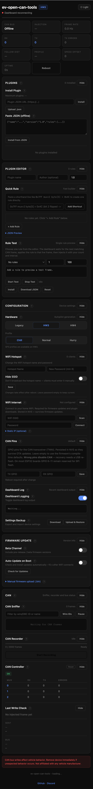

# Dashboard Guide

[Project Home](../) | [Documentation](index.md) | [Build & Flash](building.md) | [Plugin System](plugins.md) | [Release Notes](../CHANGELOG.md)

The dashboard is available on ESP32 builds that include `ESP32_DASHBOARD`. It runs from the device itself and is intended for local management at `http://100.100.1.1/` while connected to the device hotspot.

## Dashboard Surfaces

The dashboard is organized around three usage surfaces:

- **驾驶状态 / 驾驶状态中心**: the default driving-first home page. It now uses a cockpit shell, ambient grid, large FSD state, vehicle attitude visual, safety strip, CAN health, hardware mode, drive style, speed strategy, runtime, firmware version, and grouped runtime metrics without exposing dense debug tables.
- **现场遥控**: the mobile layout for hotspot use from a phone. It uses a native-app-style card with one primary long-press FSD action, status cards short enough for one-handed use, and secondary risky actions kept out of the first screen.
- **CAN 诊断**: the engineering mode for live frames, recording, controller status, debug logs, and last-write checks. It uses an engineering-console hierarchy with KPI rail, frame filter, error-priority table, live timeline, recorder, controller, and debug surfaces.

## Waveshare Single-CAN Integrated Controls

### Built-in NAG suppression

The persisted selector remains `0..3` for upgrade compatibility, but runtime behavior is selected by the effective vehicle generation:

| Vehicle | Runtime behavior |
|---|---|
| Legacy | Any migrated non-zero selection enables the single Late Human Replay validation algorithm. It reads HOS from `0x399`, learns the `0x370` cadence, sends the bounded 25-point manual-dismiss profile about 1 ms after the observed OEM frame with `counter + 1`, and asserts hands-on level 1 in byte 4. |
| HW3 | Modes A/B/C retain the corrected upstream behavior. Mode C uses the current `0x399` HOS and `0x129` steering layouts. |
| HW4 | All built-in NAG modes fail closed to Off. |

Legacy permits at most two approximately one-second attempts with opposite directions. HOS returning to `<=2` stops immediately; a persistent warning after both attempts enters cooldown. Observation remains active while final transmit gates are closed, but no frame can transmit until CAN Write, OTA, AP Gate, Abort Guard, HOS freshness, cadence, and the post-RX send window all allow it.

`/status.builtInNag` and the FSD Guard page expose profile progress, attempts, HOS before/after, learned cadence, RX/TX/OEM timing, counters, collisions, missed windows, and success/failure evidence. Reset Stats clears the active NAG session counters.

### AP Injection Gate and Instant Engage

The AP delay remains configurable from `0` to `3000ms`, with the local default unchanged at `2000ms`. **Instant Engage (experimental)** is off by default and is synchronized across desktop/mobile `.ap-instant-edge-tgl` controls.

- API field: `ap_first_edge`
- NVS key: `apfe`
- Backup field: `device.apFirstEdge`
- Legacy state `2`: blocked
- Legacy states `3..6`: engaged
- Genuine non-engaged → engaged edge: may bypass an unsatisfied delay once
- Sustained engaged state: cannot create repeated bypasses
- Parent AP gate off: control becomes inactive/disabled but keeps its checked value

Instant Engage changes only the Legacy `0x3EE mux0` debounce decision. CAN/FSD enablement, OTA blocking, the parent AP gate, `checkAD`, gear logic, Abort Guard, Soft Engage, plugins, and feature enablement remain authoritative. Runtime evidence is exposed under `/status.fsdDiag.gate` and in serial `system_status`, including edge and consumed-bypass counters.

Abort Guard follows upstream AP semantics: state 2 is Available, not engaged, so it re-arms a prior state-8/9 latch. Minimal Inject is a separate, default-off experimental option. It bypasses the AP debounce only at an AP state-3 engagement edge and allows five FSD activation mux0 writes per engagement, then blocks further activation writes until disengage. It never broadens NAG, speed-offset-only, mux1, or mux2 transmission permissions.

## CAN Tools

- **CAN Sniffer**: live frame view with filtering by ID or known frame name
- **Wire / DBC ID toggle**: switch between on-wire 11-bit IDs and prefixed DBC-style IDs
- **CAN Recorder**: capture up to 2000 frames and export them as CSV
- **CAN Controller**: inspect per-mux RX/TX/error counters and controller error flags
- **Live Log**: view firmware log output directly in the dashboard

## Connectivity And Updates

- **WiFi Hotspot**: change AP name and password, optionally hide the SSID, and keep the values across reboots and firmware updates
- **WiFi Internet**: scan for networks, connect as STA, and optionally store a static IP/gateway/mask/DNS configuration
- **Firmware Update**: check GitHub releases, switch between stable and beta channel, enable auto-update on boot, or upload a local `.bin` manually
- **CAN Pins**: override TWAI TX/RX GPIO pins at runtime for supported boards; settings are stored in NVS
- **Settings Backup**: export and restore AP, WiFi, CAN pin, update, and plugin replay settings as JSON

## Plugins

- **Plugins card**: install from URL, upload a `.json`, or paste JSON directly when offline
- **Plugin list**: inspect rules, enable or disable plugins, remove them, and spot priority overlaps between enabled plugins
- **Plugin Editor**: create plugins without hand-writing JSON, preview the result live, load an installed plugin back into the editor, download the generated file, and add a quick rule from shorthand such as `0x7FF mux=2 byte[5] = 0x4C`
- **Rule Test**: wait for a matching live CAN frame, apply one editor rule to that frame, then send the result repeatedly with a chosen count and interval
- **Plugin Replay**: set how many modified GTW 2047 (`0x7FF`) plugin frames are sent for each observed GTW frame
- **Periodic emit plugins**: use `emit_periodic` rules to keep the last modified GTW mux 3 value on the bus, optionally with GTW UDS silent-mode keep-alives
- Plugin-based overrides such as Summon unlock can live here instead of on the main Features card
- Generic plugin-managed dashboard builds inject automatically through enabled plugins; the Waveshare standalone product additionally owns the documented opt-in Legacy handler modes and their safety gates
- Dashboard cards can be collapsed individually with `Hide` / `Show` to keep the page shorter on mobile

## Persistence Notes

- WiFi hotspot settings, WiFi internet settings, update flags, CAN pins, the saved four-mode NAG selection, and several runtime defaults are stored in NVS
- Instant Engage is stored as `apfe` (default `false`); disabling its parent AP gate does not erase the saved value, while runtime reset clears only transient edge/debounce state
- Installed plugins live on SPIFFS, start disabled after install, and restore their enabled or disabled state on boot
- On AtomS3 Mini builds, the built-in button can toggle injection and that state is also persisted

## UI Copy Notes

The dashboard uses the refined Task 4 Chinese copy for the redesigned UI, including labels such as `驾驶状态`, `硬件模式`, `驾驶风格`, `速度策略`, `CAN 诊断`, and `FSD 防护`. Technical acronyms such as FSD, CAN, HW, NVS, OTA, TX/RX, EFLG, DBC, and GPIO are intentionally kept in English because they are standard protocol or firmware terms.
